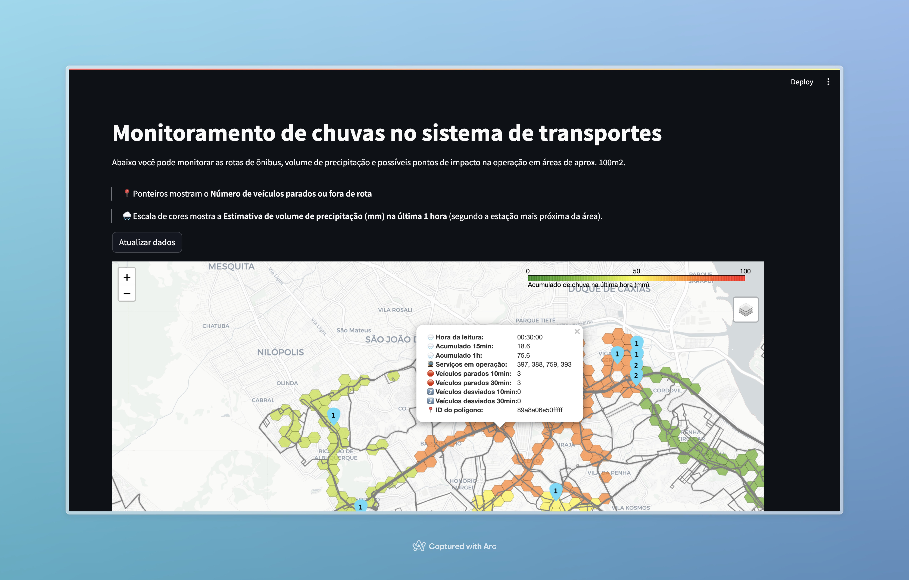

# Monitoramento do impacto de chuvas na operação de transportes

Ferramenta de apoio ao acompanhamento da operação de serviços de
transporte municipal em dias de chuva.

- 🌧️ Precipitação nos últimos 15 min e 1 hora
- 🚍 Veículos parados e fora de rota nos últimos 10 min e 30 min
- 🌊 [Alagamentos em tempo
  real](<https://api.dados.rio/v2/clima_alagamento/>) (*A desenvolver*)
- 🛜 Posição dos veículos em tempo real (*A desenvolver*)

